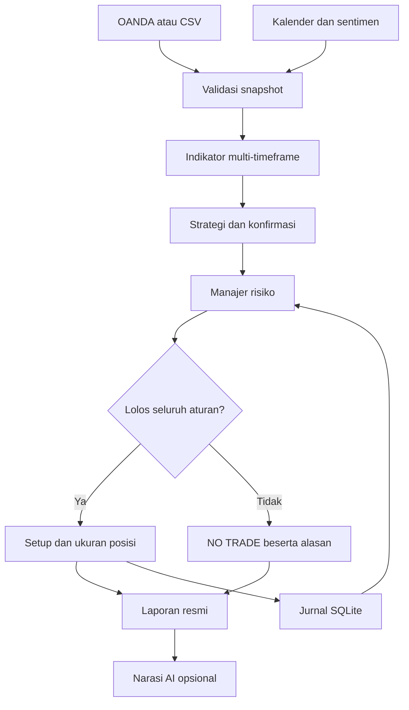

# Arsitektur dan workflow

Agent memakai orkestrasi terstruktur: data → observasi → kandidat → validasi risiko
→ keputusan → penjelasan. Jalur keputusan dapat dijalankan tanpa model bahasa.

Panah setup ke jurnal mencatat **penerbitan sinyal**, bukan transaksi broker.
Transaksi benar-benar dibuka/ditutup hanya dicatat lewat perintah jurnal terpisah.
AI tidak mempunyai jalur balik untuk mengganti keputusan atau mengirim order.

| Modul | Tanggung jawab |
|---|---|
| `models.py` | Tipe, angka finite, OHLC, timestamp timezone-aware, batas policy |
| `providers.py` | Baca OANDA/CSV, normalisasi, sentimen Alpha Vantage |
| `indicators.py` | Indikator causal, pivot yang menunggu dua candle konfirmasi |
| `fundamentals.py` | Kelengkapan kalender, veto berita, konteks sentimen |
| `strategies.py` | Kandidat trend/breakout/pullback, lima pemeriksaan |
| `risk.py` | Units, lot ekuivalen, RR bersih, margin, risiko gabungan |
| `journal.py` | Jurnal SQLite dan transaksi atomik deduplikasi/kuota sinyal |
| `agent.py` | Orkestrator yang memberi prioritas veto atas kandidat |
| `llm.py` | Narasi menggunakan payload whitelist dan prompt terpaket |
| `cli.py`, `api.py` | Antarmuka pengguna; policy server tidak diambil dari request |

## Alur Signal Mode

1. Tentukan pair, timeframe, policy, dan satu database akun.
2. Ambil candle, quote bid/ask, metadata broker, konversi, dan status akun.
3. Validasi urutan/waktu candle, warm-up 250 candle, kelengkapan timeframe,
   data masa depan, serta celah data terbaru. Pasar tutup atau quote lama diblokir.
4. Hitung trend, momentum, volatilitas, struktur, pola, S/R, dan Fibonacci.
5. Validasi cakupan dan freshness kalender. Tolak periode high-impact.
6. Baca jurnal: jumlah transaksi, P/L hari ini, risiko posisi, eksposur mata uang,
   cooldown dan kecocokan jumlah trade akun. Untuk akun nyata, cocokkan setiap
   ID tiket, pair, arah, units, entry/SL/TP dan batas bawah risiko. Periksa ekuitas
   untuk floating drawdown.
7. Pilih kandidat; periksa keselarasan timeframe, RSI, momentum, candle, dan BB.
8. Tentukan area entry pada penutupan terakhir, SL berbasis ATR/struktur, dan target
   minimum RR bersih. Tolak jika S/R terkonfirmasi pada timeframe terkait menghalangi target.
9. Hitung units dengan batas risiko dan margin; periksa kembali risiko portofolio.
10. Klaim fingerprint sinyal secara atomik. Terbitkan laporan dengan masa berlaku
    sampai candle berikutnya. Permintaan serentak tidak dapat menerbitkan ulang fingerprint.
11. Bila diminta, kirim ringkasan yang disaring ke AI untuk narasi tambahan.
12. Pengguna menilai setup, memperbarui data dan risiko sebelum entry, lalu mencatat
    hasil nyata dalam Journal Mode.

## Mode lain

Analyst berhenti setelah observasi dan evaluasi fundamental; tidak memerlukan
perhitungan entry. Risk Manager memakai level yang diberikan pengguna, memeriksa
pasar/fundamental/risiko, dan tidak menyatakan strategi terkonfirmasi. Journal
menyimpan P/L aktual secara manual dan menghasilkan metrik dari trade tertutup.

## Batas keadaan dan concurrency

SQLite memakai WAL dan `BEGIN IMMEDIATE` pada penerbitan sinyal. Cooldown dan kuota
bersifat global per database akun, lintas pair. Simulasi dan data nyata dipisahkan.
Sinyal dari mode analisis yang belum dieksekusi tidak otomatis menjadi posisi atau reservasi margin.
Sebelum mengeksekusi lebih dari satu ide, masukkan posisi aktual dan refresh snapshot.
Paket ini belum menyediakan rekonsiliasi broker per tiket, multi-tenant auth, atau
mesin antrean terdistribusi. Gunakan satu database konsisten untuk setiap akun.

## Jalur riset paper terpisah

`backtest.py` memproses OHLC lengkap per simbol dalam urutan waktu tetap dan
`orderbook.py` menyimpan order/fill **paper** serta reservasi risiko. Mode replay
agent memanggil `ForexAgent.analyze` dengan hanya candle dan kalender yang telah
tersedia pada waktu itu; jurnal simulasi mengikuti fill dan exit. Mode SMA adalah
contoh mesin replay tersendiri. `research.py`
melatih model baseline di data historis dengan split kronologis; skornya tidak
dipakai untuk mengirim order. Detail dan rencana migrasi ada di
[PLATFORM_ROADMAP.md](PLATFORM_ROADMAP.md).
