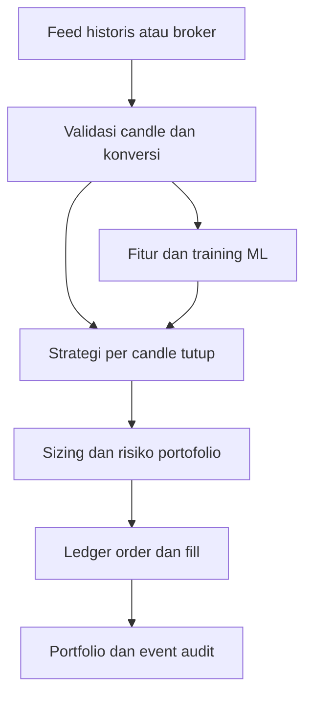

# Audit dan roadmap platform trading AI

Bagian audit baseline berikut merujuk commit `a83ca5d` (25 September 2026).
Perubahan 26 September menambahkan replay aturan Signal Mode, biaya historis,
validasi timeframe dan rekonsiliasi tiket baca saja. Ini fondasi **paper/research**,
bukan sistem live dan bukan validasi profitabilitas.

## 1. Audit repository target

| Area | Temuan pada baseline | Keputusan dan risiko |
|---|---|---|
| Struktur dan arsitektur | `forex_agent/` berisi model batas, provider, indikator, strategi, risiko, agent, API/CLI, jurnal. Satu proses dengan standard library. | Pertahankan API lama; pisahkan replay dan model dari jalur keputusan tanpa memecah layanan sebelum diperlukan. |
| Data pasar | `providers.py` memetakan OANDA dan CSV menjadi snapshot multi-timeframe. `models.py` memaksa candle lengkap, waktu UTC, OHLC finite. | Pertahankan kontrak candle tutup. Data hilang antar simbol dan perbedaan timezone broker memerlukan validasi khusus saat replay. |
| Strategi/SMC | `indicators.py` dan `strategies.py` punya indikator, pivot terkonfirmasi dan proxy BOS/sweep/FVG. | Pertahankan sebagai sinyal analisis. Proxy bukan detektor order block, liquidity atau supply/demand yang tervalidasi; hindari klaim tersebut. |
| Risiko | `risk.py` menghitung units, biaya, konversi, margin dan batas portofolio. | Gunakan ulang sizing; tambahkan reservasi order tertunda agar order serentak tidak melewati limit. Validasi ulang saat fill setelah gap. |
| Eksekusi | Tidak ada order/fill di broker; OANDA hanya pembaca data. `journal.py` mencatat trade manual serta fingerprint sinyal. | Tambahkan ledger order paper; jangan anggap sinyal atau jurnal manual sebagai eksekusi broker. |
| Backtest | Tidak ada replay multi-bar di baseline. Mode simulasi semula hanya satu snapshot. | Tambahkan replay deterministik dengan kontrak waktu eksplisit, stop-first, biaya, dan fail closed ketika simbol hilang. |
| AI/ML | `llm.py` hanya memberi narasi tanpa memengaruhi keputusan. Tidak ada pelatihan atau evaluasi model. | Pertahankan batas keputusan; tambahkan riset ML terpisah, split kronologis dan model yang bisa disimpan. |
| Observabilitas | Laporan CLI/API dan jurnal SQLite; tidak ada telemetry order, rekonsiliasi tiket, recovery broker atau metrik layanan. | Event replay dapat diaudit, tetapi monitoring live dan rekonsiliasi perlu fase tersendiri. |
| Pengujian dan skala | 44 tes unit baseline; SQLite untuk satu akun/proses. | Tambah tes invariant state order, kronologi, gap, candle hilang dan leakage. Belum diuji dengan feed tick, banyak proses, atau beban produksi. |

Kekuatan yang dipertahankan: validasi boundary, pemisahan narasi LLM dari risiko,
sizing dalam mata uang akun, jurnal atomik untuk deduplikasi sinyal, dan tes standar
library. Utang desain utama: sinkronisasi state jurnal/akun berdasarkan jumlah trade
saja, tidak ada state broker per tiket, tak ada historical calendar replay, serta
parameter instrumen/konversi yang dapat berubah seiring waktu.

## 2. Benchmark konsep, bukan salinan kode

| Referensi | Gagasan yang relevan | Penerapan/keputusan di sini |
|---|---|---|
| [QuantConnect LEAN](https://www.quantconnect.com/docs/v2/writing-algorithms/key-concepts/algorithm-engine) | Pemisahan feed, strategi, portfolio, transaksi, event order. | Replay berurutan dan state order; engine produksi belum diadopsi. |
| [NautilusTrader](https://nautilustrader.io/docs/latest/concepts/) | Simulasi deterministik dan model execution/risk/portfolio dalam arsitektur event. | Event replay dan ledger idempoten; adapter venue/recovery masih roadmap. |
| [LumiBot](https://lumibot.lumiwealth.com/getting_started.html) | Antarmuka strategi dipakai untuk backtest dan broker. | `Strategy.on_close` kecil; belum ada runtime live yang memakai kontrak sama. |
| [EA31337](https://github.com/EA31337/EA31337) | Komposisi strategi dalam ekosistem MQL. | Plugin strategi Python pada replay; optimasi dan integrasi MQL nanti. |
| [EarnForex](https://github.com/EarnForex) / [PositionSizer](https://github.com/EarnForex/PositionSizer) | Ukuran posisi berdasarkan risiko, mata uang, komisi, spesifikasi instrumen. | Pertahankan `risk.py` dan verifikasi pada saat fill. |
| [aiomql](https://github.com/Ichinga-Samuel/aiomql) | Abstraksi Python untuk MT5. | Kandidat adapter di fase live; tidak bergantung pada terminal sekarang. |
| [MQL5 scripts](https://github.com/GeneralTradingSarl/-mql5_scripts) | Pola utilitas MetaTrader. | Referensi integrasi; tidak menyertakan/mengopi skrip MQL. |
| [Backtesting.py](https://kernc.github.io/backtesting.py/doc/backtesting/backtesting.html) | Pemrosesan strategi per candle, order market pada open berikutnya. | Semantik next-open dan asumsi intrabar terdokumentasi. |
| [Smart Money Concepts](https://github.com/joshyattridge/smart-money-concepts) | Definisi FVG, swing, BOS, likuiditas, order block. | Pertahankan proxy yang sudah ada; tambahkan detektor baru hanya dengan definisi kausal dan tes delay konfirmasi. |
| [TA4J](https://ta4j.github.io/ta4j-wiki/) | Indikator dan aturan yang dapat dikomposisikan. | `Strategy` protocol; katalog indikator terpisah dapat tumbuh berikutnya. |
| [Gym AnyTrading](https://github.com/AminHP/gym-anytrading) | Antarmuka lingkungan langkah/aksi/ganjaran. | Rancangan RL fase lanjut setelah biaya dan P/L simulator tervalidasi. |
| [Forex Analyst](https://github.com/heisallaki/Forex-Analyst) | Riset fitur dan model prediksi sebagai inspirasi. | Baseline regresi logistik mandiri; evaluasi lintas dataset belum dilakukan. |

Tabel ini adalah pemetaan konsep dari dokumentasi proyek, bukan hasil pengujian
setiap framework dengan dataset dan broker yang sama. SMC bersifat heuristik;
deteksi struktur tidak membuktikan keberadaan order institusional.

## 3. Arsitektur yang direkomendasikan



`agent.py` tetap menjadi antarmuka analisis yang ada. Untuk replay, `backtest.py`
memegang jam simulasi dan memanggil `Strategy.on_close`; `orderbook.py` menyimpan
status/order/fill dan reservasi; `research.py` menghasilkan model riset. Jalur
adaptasi broker nanti harus menambahkan antarmuka `ExecutionClient`, rekonsiliasi
berdasarkan tiket dan event yang tahan restart sebelum order nyata diizinkan.
Proses tunggal mengurangi koordinasi state; pemecahan menjadi worker atau message
bus dilakukan jika profil beban nyata membenarkannya.

## 4. Yang sudah diimplementasikan

| Modul | Kontrak saat ini |
|---|---|
| `forex_agent/orderbook.py` | SQLite WAL, `BEGIN IMMEDIATE`, `client_id` unik, `execution_id` unik, PENDING/PARTIAL/FILLED/CANCELLED/CLOSED, reservasi portofolio/mata uang sampai exposure ditutup. Paper saja. |
| `forex_agent/backtest.py` | Replay next-open, biaya per candle, financing per unit, mark-to-market, stop-first, batas drawdown, metrik dan hash dataset. `--strategy sma` tetap contoh mesin fill. |
| `forex_agent/replay.py` | `--strategy agent` memakai `ForexAgent.analyze` yang sama dengan mode sinyal, memotong konteks dan kalender pada waktu historis, merekam jurnal simulasi, serta membatalkan fill di luar area entry. |
| `forex_agent/reconciliation.py` dan `providers.py` | OANDA `/openTrades` dan ID transaksi akun; cocokkan ID tiket, pair, arah, ukuran, entry, SL, TP, dan batas bawah risiko dengan jurnal sebelum sinyal nyata. |
| `forex_agent/research.py` | Baseline logistik, split kronologis dengan purge, scaler training saja, validasi interval timeframe, hash dataset, threshold validasi dan test terpisah. |
| `forex_agent/cli.py` | `backtest`, `train`, `predict`, tautkan tiket jurnal lama; mode lama masih bekerja. |

### Kontrak dataset replay

Lihat [`examples/backtest.synthetic.json`](../examples/backtest.synthetic.json).
Root wajib berisi `simulated: true`, `timeframe`, `initial_equity`, `account_currency`,
`bars` per simbol, `instruments` per simbol, dan `assumptions.spread` per simbol.
Zona hari risiko bawaan `Asia/Bangkok` dapat diganti dengan `timezone` IANA.
`assumptions.spread` dan `assumptions.slippage` dapat berupa angka tetap atau
array sepanjang candle per pair. Slippage adalah allowance **roundtrip**;
setengah dikenakan pada entry dan exit. `assumptions.financing_per_unit` opsional
berisi `BUY`/`SELL` dalam mata uang akun per unit per candle; tanpa input biaya
financing diasumsikan nol dan hasil tidak mencerminkan swap aktual. Seluruh simbol
harus punya timestamp close yang sama, berurutan,
pada interval timeframe (kecuali jeda akhir pekan terbatas), tanpa candle belum
tutup. Harga OHLC adalah midpoint. Untuk quote currency yang
berbeda dari currency akun, **setiap bar** wajib berisi `quote_to_account` positif
dan `conversion_time` persis sama dengan waktu close bar. Faktor konversi konstan
tidak diasumsikan untuk pasangan seperti USD/JPY. Pada open, engine hanya boleh
memakai konversi dari close candle sebelumnya; pada close, memakai nilai candle
itu. Ini pendekatan konservatif terhadap ketersediaan data, bukan simulasi quote
konversi pada setiap fill.

Untuk `--strategy agent`, sediakan `context_frames[pair][timeframe]` minimal 250
candle tutup tiap timeframe konteks dan `fundamentals_history` berupa daftar
snapshot kalender berurutan `as_of`. Replay hanya memberikan data dengan
timestamp ≤ waktu keputusan; `actual` dari event yang belum terjadi ditolak.
Ketiadaan kalender segar menyebabkan NO_TRADE. Data contoh ada di
[`agent-replay.synthetic.json`](../examples/agent-replay.synthetic.json).

Pada timestamp yang sama, pemrosesan close sebelumnya terjadi sebelum open
berikutnya. Strategi SMA kustom tetap dipanggil saat ada posisi, tetapi
replay agent melewati posisi aktif agar tidak menghabiskan kuota penerbitan
sinyal. Jika SL dan TP sama-sama tercapai intrabar, SL diambil. Gap pada
posisi terbuka dieksekusi pada open buruk aktual untuk stop; order entry baru
dibatalkan jika gap membuat level/anggaran atau area entry tidak valid. Drawdown mark-to-market
melatch larangan order baru; posisi yang sudah terbuka tetap mengikuti stop/TP.
Bar terakhir tidak dapat mengisi order yang baru diajukan pada bar itu.

### Reproduksi lokal

```bash
python scripts/generate_backtest_example.py
python -m scripts.generate_agent_replay_example
python -m unittest discover -s tests -v
python -m forex_agent backtest --data examples/agent-replay.synthetic.json --out data/agent-result.json
python -m forex_agent backtest --data examples/backtest.synthetic.json --strategy sma --out data/sma-result.json
python -m forex_agent train --data examples/backtest.synthetic.json --pair EUR/USD --timeframe M5 --out data/model.synthetic.json
python -m forex_agent predict --model data/model.synthetic.json --data examples/backtest.synthetic.json
```

Contoh SMA 180 bar sintetis menghasilkan 3 trade tertutup dengan hasil negatif;
contoh agent menghasilkan satu sinyal dan fill yang berhenti di SL buatan.
Metrik klasifikasi tinggi pada gelombang sintetis yang
periodik tidak relevan untuk klaim keuntungan forex nyata.

## 5. Roadmap, prioritas dan migrasi

| Fase | Tujuan, file utama | Teknologi dan prioritas | Kompleksitas / gerbang selesai |
|---|---|---|---|
| 1 — Fondasi | Pertahankan `models.py`, `risk.py`, `agent.py`; perluas `tests/`, dokumentasi data dan validasi historis. | Python standard library; P0. | Sedang. Invariant waktu/simbol/risiko dan 44 tes lama lulus. |
| 2 — Paper dan strategi | `orderbook.py`, `backtest.py`, `replay.py`, `cli.py`; berikutnya data catalog dan validasi terhadap fill broker demo. | SQLite, replay deterministik; P0. | Besar. Bandingkan trade, kalender, biaya, gap, dan state restart dengan broker demo. |
| 3 — ML/RL | `research.py`; berikutnya dataset versi, walk-forward beberapa rezim, kalibrasi, experiment tracking, lingkungan RL dengan reward setelah biaya. | Baseline Python; NumPy/scikit-learn/Gym opsional setelah kebutuhan terukur; P1. | Besar. Out-of-sample berulang, embargo sesuai horizon, tidak ada leakage, benchmark strategi nol. |
| 4 — Live | Buat `brokers/`, `execution/`, `monitoring/` setelah interface dan tes kontrak; koneksi MT5/OANDA, WebSocket, circuit breaker, observabilitas. | Adapter broker spesifik, penyimpanan event/tiket, secret management; P2 sampai semua gerbang aman. | Sangat besar. Rekonsiliasi restart, idempotensi broker, timeout/retry, kill switch dan uji akun demo. |

Migrasi: jangan mengganti API `analyze`/`risk` dan tabel `trades`/`signals` yang
ada. Gunakan database ledger paper sendiri agar ID order tidak disalahartikan
sebagai trade jurnal. Sebelum live, buat migrasi berversi untuk event/tiket,
akun yang tervalidasi, dan pemetaan fill ke posisi; setiap fill broker harus
direkonsiliasi persis sekali. `OrderBook` menerima angka risiko dari pemanggil;
adapter baru wajib menghitungnya dengan `size_position` dari quote/spec aktual,
bukan mempercayai payload klien.

## 6. Batas hasil saat ini

Backtest hanya memakai OHLC dan urutan stop-first, bukan tick/order book; belum
memodelkan likuiditas, partial fill simulasi, sesi/holiday, latency, atau
konversi intra-bar. Financing yang terjadi di masa depan tidak masuk estimasi
`initial_risk` saat order diajukan; perubahan ekuitasnya tetap muncul pada replay.
Financing dan kalender historis perlu disuplai pengguna;
tidak ada unduhan atau verifikasi sumber historis otomatis. Ledger paper mampu
mencatat fill parsial, tetapi backtest memberi fill penuh atau membatalkan entry.
Skor logistik bukan probabilitas terkalibrasi dan belum masuk jalur keputusan
live. Belum ada RL, live order API, MT4/MT5 adapter, WebSocket, multi-tenant,
recovery broker, atau klaim profitabilitas. Uji paper jangka panjang dan data
pasar berlisensi adalah prasyarat sebelum merancang fitur live.
